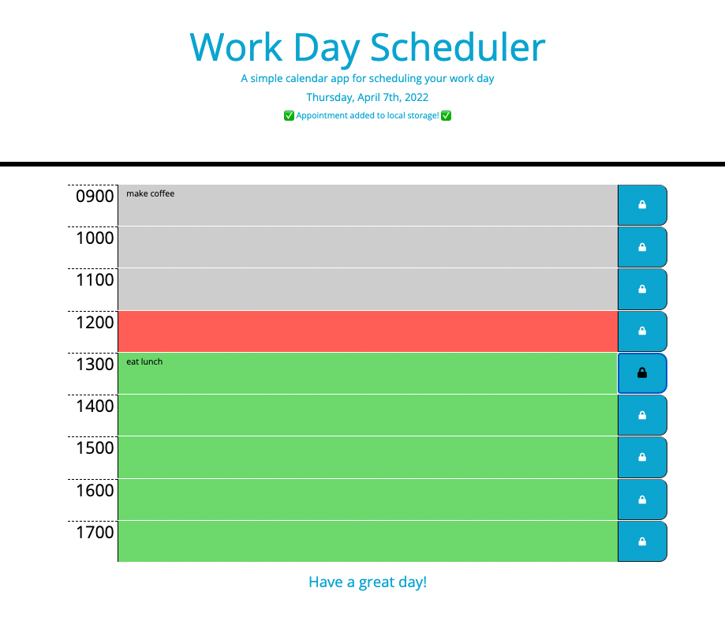

# Work-Day-Scheduler
LICENSE : [GNU Public License](./LICENSE)

INSTALLATION: For this repositiory and clone it to your local source using git clone commands.

PACKAGES/LANGUAGES: This repositiory uses Bootstrap, Moment.js, jQuery, Javascript, CSS and HTML. 

DESCRIPTION: This project is a day planner that utilizes Moment.js to identify the current date and time, as well as local storage to save events added to the day's schedule. Starter code for the HTML and CSS was provided through University of Washington Web Development Bootcamp. The goal of this project is to create a tool that helps a busy employee manage their time effectively. When you open this planner, the current date is displayed at the top. Timeblocks for standard business hours are included in the planner - past time appears gray, the current hour red, and future time green. The time is checked every 30 seconds. When the user clicks on a time block, they can type in events, activities or appointments for the hour. Clicking the lock will save the events to local storage. A notification pops up in the header for 5 seconds incidcating the appointment was saved. When the page is refreshed, the saved events will still appear in the schedule. The events are saved based on date, so opening on a different date will not contain the events entered for previous days. 

Please check out this project by clicking [here](https://hseymo.github.io/Work-Day-Scheduler/).

APPLICATION: 

Acknowledgments: Thank you to the University of Washington Web Development Bootcamp for teaching me the skills and providing the starter HTML and CSS code to create this page.

QUESTIONS: If you have questions, please contact me on Github at [hseymo](https://githup.com/hseymo) or by [email](mailto:fake@gmail.com).